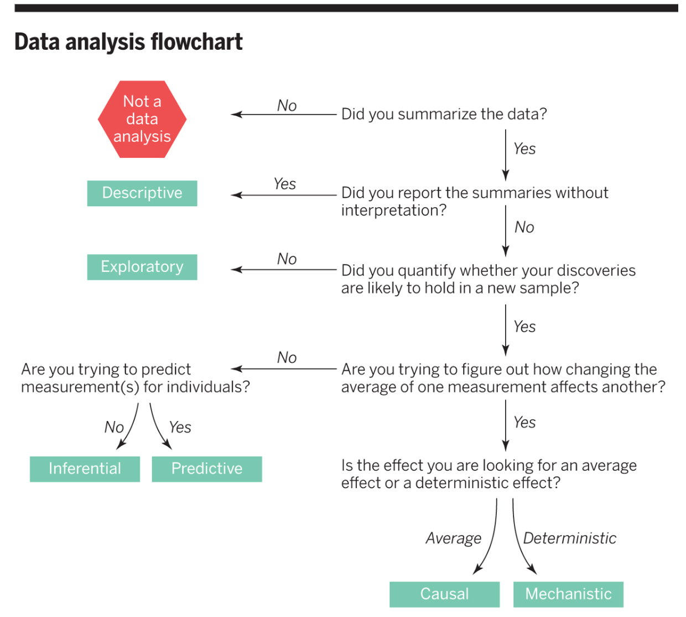

```{r setup, include=FALSE}
options(htmltools.dir.version = FALSE)
library(knitr)
opts_chunk$set(echo = TRUE)
```

```{r xaringan-themer, include=FALSE, warning=FALSE}
library(xaringanthemer)
style_duo_accent(
  primary_color = "#9F999C",
  secondary_color = "#FFE5F3",
  inverse_header_color = "#8F8C8E",
  link_color = "deeppink",
  title_slide_text_color = "#3d3d3d",
  title_slide_background_image = "img/title-slide-background-light.png",
  title_slide_background_position = "left",
  header_font_google = google_font("Josefin Sans"),
  text_font_google   = google_font("Montserrat", "300", "300i"),
  code_font_google   = google_font("Fira Mono")
)
```

## Module learning objectives

By the end of this module, students should be able to:

- Identify the different types of data analysis questions and categorize a question into the correct type

- Identify a suitable analysis type to answer an inferential question, given the data set at hand

- Use the R programming language to carry out analysis to answer inferential question

- Interpret and communicate the results of the analysis from an inferential question

---

## What is the question?

```{r what-is-the-q, out.width = "50%", echo = FALSE, fig.cap = "What is the question? by Roger Peng and Jeff Leek"}

```

---

#### 1. Descriptive

One that seeks to summarize a characteristic of a set of data. No interpretation of the result itself as the result is a fact, an attribute of the data set you are working with.

--

Examples:

- What is the frequency of viral illnesses in a set of data collected from a group of individuals?

--

- How many people live in each US state?

---

#### 2. Exploratory

One in which you analyze the data to see if there are patterns, trends, or relationships between variables looking for patterns that would support proposing a hypothesis to test in a future study.

--

Examples:

- Do diets rich in certain foods have differing frequencies of viral illnesses **in a set of data** collected from a group of individuals? 

--

- Does air pollution correlate with life expectancy **in a set of data** collected from groups of individuals from several regions in the United States?  

---

#### 3. Inferential

One in which you analyze the data to see if there are patterns, trends, or relationships between variables in a representative sample. We want to quantify how much the patterns, trends, or relationships between variables is applicable to all individuals units in the population.

--

Examples:

- Is eating at least 5 servings a day of fresh fruit and vegetables is associated with fewer viral illnesses per year?

--

- Is the gestational length of first born babies the same as that of non-first borns?

---

#### 4. Predictive

One where you are trying to predict measurements or labels for individuals (people or things). Less interested in what causes the predicted outcome, just what predicts it.

--

Examples: 

- How many viral illnesses will someone have next year?

--

- What political party will someone vote for in the next US election?

---

#### 5. Causal

Asks about whether changing one factor will change another factor, on average, in a population. Sometimes the underlying design of the data collection, by default, allows for the question that you ask to be causal (e.g., randomized experiment or trial)

--

Examples:

- Does eating at least 5 servings a day of fresh fruit and vegetables cause fewer viral illnesses per year?

--

- Does smoking lead to cancer?

---

#### 6. Mechanistic

One that tries to explain the underlying mechanism of the observed patterns, trends, or relationship (how does it happen?)

--

Examples:

- How do changes in diet lead to a reduction in the number of viral illnesses?

--

- How does how airplane wing design changes air flow over a wing, leading to decreased drag?

---

### So you know the type of question, now what?

This helps narrow down the possibilities 
of the kind of analysis you might want to do!

--

For example, if you have the question: "How many viral illnesses will someone have next year?"
and you identify that it is predictive. 
You could narrow down that some kind of statistical or machine learning model 
might help you answer that.

--

Then you need to go a step deeper and look at the data that you have, 
and see which kind of statistical 
or machine learning model is most suitable for your data.

<!--draw sketch of the data-->

<!--draw figure like this but better: https://towardsdatascience.com/types-of-machine-learning-algorithms-you-should-know-953a08248861-->

---

## Another example 

For example, if you have the question: "Is the gestational length of first born babies the same as that of non-first borns?"
and you identify that it is inferential. 
You could narrow down that some kind of statistical inference approach 
might help you answer that.

Then again, you need to go a step deeper and look at the data that you have, 
and see which kind of statistical inference approach is most suitable for your data.

<!--draw sketch of the data-->

<!--draw figure like this but better: https://towardsdatascience.com/types-of-machine-learning-algorithms-you-should-know-953a08248861-->

---

## Practice

---

### Case 1

---

### Case 2

---

### Case 3

---

## The statistical landscape in R

<!-- ecosystem R base + tidymodels-->

--- 

## Let's talk a little more about statistical inference

- intro slides from DSCI 100
- intro slides from STAT 201

---

## Example of a common inferential analysis in R

- case: fruit fly example
- start with visualization (uncertainty focus!)

---

## Example of t-test

- demo formula notation
- demo non-tidy output

---

## Example of ANOVA

---

## Example of linear regression

- again start with visualization
- ref-treatment in R
- demo non-tidy output, and how to get tidy

---

## Common things that go wrong in biostatistics

1. Data analysis does not match the question

2. ...

---
